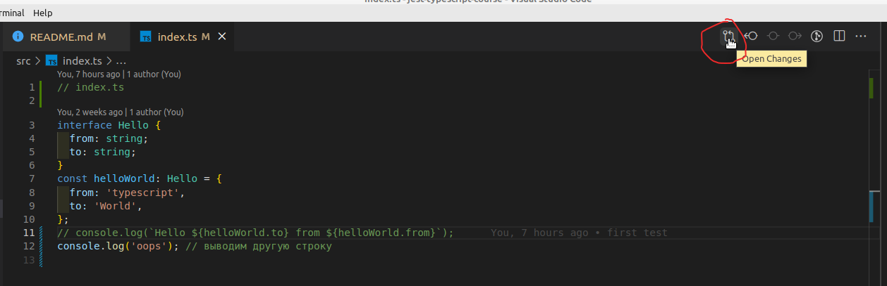
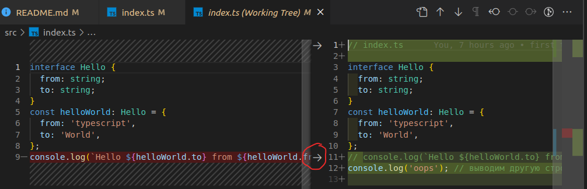
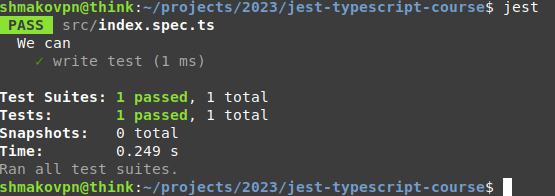

# Jest typescript course

Тестирование `typescript` кода с использование `jest`.
Testing `typescript` code using `jest`.

```
Доверяй и не перепроверяй.
```

Для чего все это надо? Я же задам вопрос по другому, как стать ценным специалистом, особенно если вы новичок.
Если вы новичок, вам не доверяют.

_Хотя вопрос куда глубже, не стоит заниматься шапкозакидательством, излишне доверяя даже самому себе, вне зависимости от того новичок вы или специалист с десятилетним опытом_.

И так. Вам ненадежен. Значит за вами надо перепроверять. Перепроверять - тратить время старших коллег.

Даже если вы работаете за 0 рублей, фирма все равно несет большие издержки.
Поэтому, без опыта вас не возьмут даже _за еду_, так как попутно потребуется кормить еще и middle-а
или даже senior-а, чьи аппетиты дорого обходятся любой компании.

Если вы пишите тесты, и делаете это на хотя бы минимально достойном уровне, ваш код работает и это можно доказать.
Таким образом, за счет автоматизации бизнес процесса код-ревью, можно существенно сэкономить время старших коллег.

Ура! В списке из 10ков тысяч Junior-ов:

- имеющих примерно одинаковые запросы по зарплате,
- обладающих начальными, но уже вполне достаточными знаниями основ языка для написания хоть как-то работающего кода.

Среди бесценных специалистов, т.е. людей пока еще не представляющих какой-либо ценности.
Вы человек которому можно доверять. Поверьте senior-ы, которые будут вас собеседовать, тоже люди, им есть чем заняться помимо вас, и они не хотят страдать.

## About this way

Небольшое лирическое отступление. О пути постижения знаний, предлагаемом автором в этой книге.

Вы водите автомобиль? У вас есть права? Возможно вы хотя бы на них учились.

Основная задача занятий на полигоне с инструктором, сформировать у курсанта условные рефлексы,
довести базовые навыки до автоматизма. Водитель на дороге должен оперативно принимать
решение о повороте, обгоне, стоит ли заехать на заправку или припарковаться.
Внимание водителя сосредоточено на более стратегических задачах, чем нажатие педалей,
переключение передач или вращение руля. Водитель не открывает инструкцию по эксплуатации автомобиля
во время движения чтобы нажать на тормоз.

Когда я учился на инженера в университете, нас часто заставляли заучивать формулы.
Мы возмущались, зачем? Ведь мы инженеры, мы должны знать "где посмотреть" и зубрежка нам ни к чему.
Однако, память человека работает в тысячи раз быстрее книг и справочников, также как RAM компьютера,
по сравнению с жестким диском. Автоматизмы и условные рефлексы существенно быстрее памяти,
их быстродействие подобно регистрам процессора по отношению к RAM.

Кому нужен программист, который только и делает что google-ит и читает документацию?
Которого простое действие объединить два commit-а в git-е, установить библиотеку, создать новый пустой проект, файл или тест, погружает в ступор и google-ние. Вы бы взяли на работу человека,
который настолько медленный, пускай он даже способен найти чуть ли не все на этом свете, но потом?

Конечно, не стоит вдаваться в крайности между "все заучить" и "google-программированием".
Однако, базовые автоматизмы должны быть обязательно. Такие как: основные команды git, npm,
синтаксис самого языка и умение пользоваться отладчиком.
Сюда я также отношу способность не задумываясь начать писать новый тест.
С опытом условные рефлексы придут сами собой и глубоко отложатся где-то на подкорке головного мозга.
Если тянуть за ботву, марковка быстрее не вырастет, всему свое время. Но, лучше все таки посадить ее
в правильное место, где она быстрее вырастет сама.

Есть навыки которые лучше натренировать у себя сразу,
чтобы остальной процесс шел быстрее, мягче и эффективнее.
Если водителю все равно предстоит освоить параллельную парковку, лучше сделать это как можно раньше,
еще на полигоне. Хотя, никто не мешает, столкнувшись с ситуацией на дороге, открыть google,
найти ближайшее поле, оставить машину там, пробежавшись до офиса пешком,
в очередной раз отложив на потом "знание git-а или jest-а".

## Для пользователей `Windows`

Материал книги ориентирован на пользователей операционной системы `Linux`.
Скорее всего вы не один из них. Выход есть, их целых три.

- Установите `Linux`,
- Установите `WSL`,
- Установите `git-bash`

`Linux`. Илья Муромец, предпочел бы убиться сразу и выбрал бы первый путь.
Это отличный вариант, особенно если вы хотите быть backend-разработчиком.
Самый сложный путь, если пойти им, к typescript-у вы вернетесь не скоро.

`WSL` - полноценный `Linux` под `Windows`. Придется повозиться с установкой. Гугл вам в помощь.
Но у вас будет `Linux`.
Конечно он будет немного отличаться от систем работающих на реальных серверах.
Однако эти тонкости, касаются больше системных администраторов чем разработчиков.
Раз это `Linux` остаются проблемы с порогом входа.
Вам по прежнему придется установить все необходимые программы (`node`, `git`) как в `Linux`.
Но, при этом у вас останется основная ОС `Windows`.

`git-bash`. Пакет с пакетами, два в одном: система контроля версий `git` и эмулятор терминала `bash`.
Вы продолжаете пользоваться `Windows` программами, при этому получаете возможность создавать
и запускать `bash` скрипты (аналог bat-ников). Самый быстрый путь. Для работы с данной книгой его будет достаточно.

Я рекомендую начать с `git-bash` и когда ваши руки немного привыкнут писать команды в терминале,
установить себе `WSL`.

## Create project structure

Создание структуры приложения.

Первым делом создадим папку проекта. В ней будет происходить вся работа.

```bash
mkdir jest-typescript-course  # создаем папку
cd jest-typescript-course  # переходим в нее
code .  # открываем созданную папку в среде разработки VSCode
git init  # делаем папку проекта git-репозиторием
touch README.md  # создаем файл с описанием нашего проекта
touch .gitignore  # создаем конфигурационный файл исключений git-а, оставим пока его пустым.
npm init -y  # делаем папку проекта пустым nodejs пакетом
mkdir docs  # создадим папку с документацией
mkdir src  # создаем папку для файлов с исходным кодом
```

## Hello World

```bash
touch src/index.js  # создаем отправную точку. минимальное работающее приложение "Привет Мир"
code src/index.js  # открываем index.js в VSCode
```

Давайте хоть что-то, что работает, код на языке `javascript` для начала.

```js
/**
 * src/index.js
 */
console.log('Hello World');
```

Запустим код в терминале.

```bash
node src/index.js
```

Результат:


Если удалось получить строку `Hello World` в терминале, значит мы на правильном пути.
Идем дальше. Превратим наш код из `javascript` в `typescript` и заставим его работать.

Переименуем файл `src/index.js` в `src/index.ts`.

```bash
mv src/index.js src/index.ts  # меняем расширение файла на *.ts
code src/index.ts  # открываем полученный файл в VSCode
```

Внесем изменения в файл.

```typescript
interface Hello {
  from: string;
  to: string;
}
const helloWorld: Hello = {
  from: 'typescript',
  to: 'World',
};
console.log(`Hello ${helloWorld.to} from ${helloWorld.from}`);
```

Запустить `typescript`-код просто так уже не получиться.


Давайте установим компилятор `typescript`. Но сперва сделаем коммит в систему контроля версий `git`.

```bash
git status  # текущее состояние системы контроля версий git
```


`On branch master` - мы находимся на ветке с именем master.
`No commits yet` - у нас нет ни одного commit-а.
`Untracked files` - у нас имеются не контролируемые git-ом файлы и папки. Их имена выделены красным.
`nothing add to commit but untracked files present` - Нечего commit-ить, но есть не отслеживаемые файлы.

```bash
git add .  # добавим в снимок git текущий каталог (точка означает текущую папку)
git status  # открою маленький секрет, чем чаще вводишь git status, тем быстрее изучаешь git
```


Мы по прежнему находимся на ветке master. `On branch master` и у нас нет commit-ов `No commits yet`.
Однако, есть изменения готовые для сохранения в commit `Changes to be committed`.
Файлы помеченные зеленым войдут в будущий коммит. Который мы обязательно сделаем очень скоро.

Не стоит переживать насчет откуда то взявшихся файлов в папке docs/images

Просто, я пишу эту книгу в том же git репозитории, и git видит, как я добавляю скриншоты.
Не обращайте внимание.

Давай создадим наш первый commit. Посмотрим текущее состояние репозитория, а также историю commit-ов.

```bash
git commit -m 'first commit'
git status  # текущее состояние репозитория git
git log  # история commit-ов
```


Отлично. Мы создали новый `npm` пакет (`javascript` библиотеку), попробовали что-то запускать и зафиксировали полученный результат в виде commit-а в git-репозитории.

## Установка `typescript`

Честно. Не хотел писать про столь тривиальную вещь как установка `typescript`-компилятора.
Но давайте его установим, посмотрим, что изменилось, и причем тут git.

```bash
npm install -D typescript  # менеджер javascript-пакетов (npm) установи(install) пакет для разработки (-D) с именем typescript
```


`added 1 package, and ..` - добавлен новый `javascript`-пакет.

```bash
git status
```


Теперь у нас есть:

- `Changes not staged for commit` - измененные файлы, которые не добавлены в будущий commit
- `Untracked files` - не отслеживаемые git-ом файлы и папки.

Где:

- `node_modules/` - каталог с установленными сторонними `javascript`-пакетами (мы только что установили компилятор `typescript`)
- `package.json` - конфигурационный файл нашего `javascript` пакета. О нем поговорим, чуть позже.
- `package-lock.json` - файл с информацией об установленных пакетах.

У каждого пользователя нашей программы `package-lock.json` будет свой, он будет создавать и обновляться автоматически,
при установке или обновлении нашей программы. Распространять нашу версию данного файла не имеет никакого смысла.

Также, у каждого пользователя будет свой каталог `node_modules`. Как и файл `package-lock.json`,
он будет сформирован автоматически в зависимости от версии операционной системы пользователя,
версии `nodejs` - интерпретатора `javascript`, установленной на компьютере пользователя и т.д.
Это чужой код, как правило он занимает много места, до сотен мегабайт, распространять его только мешать и вводить компьютер пользователя в заблуждение.

К счастью, у нас есть возможность подсказать системе контроля версий, чтобы она исключила из репозитория не нужные объекты.
Внесем изменения в файл `.gitignore`.

```
# .gitignore

# чужой код
node_modules/

# файлы создаваемые автоматически
package-lock.json
```

```bash
git status
```


Ура! Мы исключили из git-а те файлы, которые мы не собирается распространять.

```bash
git diff package.json
```


Вспоминайте, что мы делали две минуты назад. Правильно. Мы установили `typescript` с ключом `-D`.
Менеджер пакетов `npm` заботливо сохранил соответствующую запись в словарик `devDependencies` (зависимости для разработки).

Пора зафиксировать изменения.

```bash
git add .
git commit -m 'установлен typescript'
git status
git log -n 1  # выведем последнюю запись в истории commit-ов
```


Теперь пришло время проверить, что `typescript` установлен.

```bash
./node_modules/.bin/tsc --version
```


На листинге выше, мы запрашиваем версию установленного компилятора. Запрос версии программы, это довольно частый прием,
чтобы проверить, что программа установлена и способна работать. Он ничего не сломает и, как правило, работает сразу,
из коробки, не требуя конфигурационных файлов и прочих настроек.

Одна строка, а как в ней много сказано. Особенно для новичка. Разберем все более детально:

- `./node_modules/.bin/` - путь к каталогу с исполняемыми файлами, которые притащил нам пакетный менеджер `npm`,
- `tsc` - компилятор `typescript`,
- `--version` - просим `tsc` вывести его текущую версию и завершится.

Предлагаю отвлечься на минутку и порассуждать на тем, зачем такой длинный путь `./node_modules/.bin/tsc`?
Почему нельзя просто `tsc`? Давайте проверим.

```bash
tsc
```


`Command 'tsc' not found` - команда 'tsc' не найдена. Так произошло, потому, что мы установили компилятор `typescript`
по факту в `node_modules`, а не там где операционная система ищет запускаемые файлы (`$PATH`).

```bash
echo $PATH
# echo - вывести на экран,
# $PATH - переменная окружения, список путей, где искать исполняемые файлы,
# разделенных через двоеточие
```


Как видим пути к `./node_modules/.bin` в `$PATH` нет. Его можно добавить.

```bash
export PATH="./node_modules/.bin:$PATH"
echo $PATH
```


```bash
tsc --version
```


"Это, что теперь каждый раз `$PATH` менять?" - спросите вы.
Выход есть, точнее выходы:

- установить `typescript` глобально,
- автоматизировать изменение `$PATH`.

Но сперва, давайте вернем `$PATH` как было.

```bash
export PATH=$(echo $PATH | sed -re 's/\.\/node_modules\/\.bin:?//')
# echo $PATH - выводит значение переменной $PATH
# | (символ конвейера) передает выведенное значение $PATH на дальнейшую обработку программе sed
# sed - stream editor, потоковый редактор текста
# -re - использовать "регулярные выражения"
# s/\.\/node_modules\/\.bin:?// регулярное выражение замены. s/шаблон поиска - что менять/на что менять/
# служебные символы (точки, слэши и т.д.) должны быть экранированы, поэтому '.' становится '\.',
# а '/' -> '\/'
# ':?' означает включить символ ':' в шаблон поиска, как опциональный.
# Если в строке находится подстрока соответствующая шаблону, она заменяется, в нашем случае на пустую строку,
# т.е. удаляется
echo $PATH  # смотрим, каким стало значение $PATH
```


Попробуйте теперь выполнить `tsc --version` и убедитесь, что `tsc` снова не работает (не находится).
Установим его глобально.

```bash
npm i -g typescript
# i краткий синоним для install
# -g установить программу в глобальный контекст
tsc --version  # посмотрим версию
./node_modules/.bin/tsc --version  # посмотрим версию установленную в контекст разрабатываемого проекта
```


Пока я писал эту главу. Вышла новая версия компилятора (4.9.5), вчера была 4.9.4.

Предлагаю посмотреть куда сейчас установлен `tsc`.

```bash
which tsc
```


Внимательные читатель заменит, что путь `/home/shmakovpn/.nvm/versions/node/v16.17.0/bin` есть у меня в `$PATH`.
Ваш путь скорее всего будет отличаться, в зависимости от того, используете вы `nvm` (node version manager) или нет,
версии самого интерпретатора и прочих факторов. Сам путь значения не имеет, главное, что он есть в `$PATH`.

Представим, что я идеалист - перфекционист. Я не хочу устанавливать ничего глобально, пусть моя система останется,
как можно более чистой. С другой стороны, я разрабатываю много разных пакетов и мне важно, использовать версию
компилятора не одну на всех, а непосредственно из пакета.
В таком случае компилятор установленный глобально меня не устраивает.

```bash
npm remove -g typescript  # удалим компилятор typescript из глобального контекста
tsc --version  # проверим, что он удалился
```


Теперь `tsc` у нас снова не работает, а вводить каждый раз `./node_modules/.bin/tsc` слишком долго.
Вводить `export PATH="./node_modules/.bin:$PATH"` каждый раз при запуске терминала, тоже так себе решение.

В операционной системе `Linux` есть специальный файл `~/.bashrc`, где '~' - это путь к домашней папке пользователя.
`~/.bashrc` является `bash`-скриптом на выполняется каждый раз при запуске терминала.

```bash
code ~/.bashrc  # открыть файл ~/.bashrc в редакторе VSCode
```

Добавьте указанную строку в конец файла.

```bash
# файл ~/.bashrc
# добавить в запускаемые пути ./node_modules/.bin если его там нет
[[ ${PATH} =~ ./node_modules/.bin ]] || export PATH="./node_modules/.bin:${PATH}"
```

Сохраните файл и откройте новое окно терминала, затем перейдите в папку проекта и запустите компилятор.

```bash
# в новом окне терминала
cd projects/2023/jest-typescript-course/  # переходим в папку проекта
tsc --version  # смотрим версию компилятора
which tsc  # смотрим куда установлен компилятор
```


Замечательно, теперь в разрабатываемых `npm` пакетах компилятор `typescript` будет браться из `node_modules`.

Ну, вот. Хотел совсем чуть чуть рассказать про установку `typescript`, а получилась целая глава.
В которой и про `npm`, и про глобальный контекст, про пути в `$PATH`, про `.gitignore`, и про то как меняется `package.json`. На этом предлагаю читателю сделать паузу и повторить все шаги, но уже на своем супер проекте,
проекте мечты, который призван перевернуть мир. Или же очередном 'Hello World', если читатель решил пока оставить
мир в покое, что тоже хорошо, так как команды из этой главы необходимо довести до автоматизма.

Вопросы к главе:

- Что будет если одновременно глобально установить `tsc` и добавить `./node_modules/.bin` в `$PATH`?
  a. `tsc` не будет работать.
  b. будет запускаться `tsc` установленный глобально.
  c. будет запускаться `tsc` установленный в `node_modules` т.к. этот путь идет первым в `$PATH`.
- Что происходит с `package.json` при установке `npm`-пакетов глобально?
  a. создается секция globalDependencies.
  b. файл не изменяется, т.к. изменения касаются операционной системы, а не разрабатываемого пакета.

## tsconfig

Компилятор `typescript` штука сложная и требует настроек,
которые он будет брать из специального конфигурационного файла `tsconfig.json`.

Подобно многим другим хорошим программам, `tsc` оснащен опцией создания конфигурационного файла по
умолчанию.

```bash
tsc --init
git status
```


Появился новый `untracked file` - `tsconfig.json`.
Зафиксируем наши достижения в систему контроля версий и двинемся дальше.

```bash
git add .  # добавляем все файлы в будущий commit
git commit -m 'tsc --init'  # делаем commit
code tsconfig.json  # открываем tsconfig.json в редакторе VSCode
```

Оставим пока `tsconfig.json`, как есть и попробуем скомпилировать наш проект.

```bash
tsc  # запускаем компилятор
git status  # смотрим, что поменялось
```

Появился новый файл `src/index.js`.


Его можно запустить.

```bash
node src/index.js
```


Сам файл `src/index.js` будет содержать `javascript` код, содержимое которого зависит от настроек в `tsconfig.json`.

```js
'use strict';
const helloWorld = {
  from: 'typescript',
  to: 'World',
};
console.log(`Hello ${helloWorld.to} from ${helloWorld.from}`);
```

Немного поэкспериментируем и изменим `tsconfig.json`.

```json
"target": "ES5",
```

Запустим компилятор.

```bash
tsc  # запускаем компилятор typescript -> javascript
code src/index.js  # отрываем созданный компилятором файл в VSCode
```

```js
'use strict';
var helloWorld = {
  from: 'typescript',
  to: 'World',
};
console.log('Hello '.concat(helloWorld.to, ' from ').concat(helloWorld.from));
```

Код изменился, теперь он полностью поддерживает es5 синтаксис, один из самых ранних стандартов `javascript`.

Цель нашей книги разобраться с написанием и запуском unit-тестов,
поэтому поддержка архаичных браузеров и скомпилированный код нас не интересует.
Мы просто от него абстрагируемся и будем у себя в голове представлять,
что запускается и работает непосредственно сам `typescript`.
Благо среда VSCode обладает всеми необходимыми средствами, чтобы эту иллюзию поддерживать.

Прежде чем пойти дальше предлагаю осмотреться.

```bash
git status
```


Изменения затронули файлы `tsconfig.json`, надо которым мы ставили эксперименты.
Эти изменения нам не нужны и хотелось бы откатить файл к предыдущему состоянию.

Также появился результат компиляции `src/index.js`.
Файлы которые появляются в результате компиляции должны распространяться отдельно,
в виде релизов, значит надо указать `git`-у исключить их из репозитория с исходным кодом.
С другой стороны располагать скомпилированные файлы рядом с исходниками очень не удобно,
это затрудняет навигацию по проекту.
Да и вообще, как я упомянул выше, результат компиляции нас не интересует.
Так же как разработчиков `C++` не интересуют нолики и единички в получаемых ими двоичных файлах.

Хорошей практикой считается создание отдельной папки для скомпилированных файлов.
Но сначала уберем ненужные изменения, и поможет нам в этом `git`.

```bash
git reset --hard  # откатываемся на последний commit
git status  # смотрим, что получилось
```


Остался болтаться `src/index.js`, его придется удалить отдельно.

```bash
rm src/index.js
```

Результаты компиляции вперемешку с исходным кодом вызывают проблемы уже сейчас.
Настала пора это исправить, открываем `tsconfig.json`.

```json
"outDir": "./dist",
```

Запускаем `tsc` и смотрим, что получилось.

```bash
tsc  # запускаем компилятор
git status  # смотрим, что поменялось
```


Появилась папка `dist`, `git status` когда находит новые папки, не раскрывает их содержимое.
Сделаем еще один смелый эксперимент, добавим все файлы в область будущего commit-а.
Однако сам commit делать не будем.

```bash
git add .  # добавить все файлы будущий commit
git status  # смотрим состояние git
```


Система контроля версий собирается добавить `dist/index.js`, так не пойдет,
репозиторий предназначен для исходного кода, а скомпилированные файлы должны входить в релизы
и распространяться отдельно.

```bash
git reset  # очищаем область будущего commit-а
git status  # смотрим состояние git
```


Команда `git reset` отменяет все сделанные ранее `git add` и очищает область будущего commit-а.

Пришло время внести изменения в `.gitignore`

```bash
# .gitignore

# скомпилированные файлы
dist/

# чужой код
node_modules/

# файлы создаваемые автоматически
package-lock.json
```

Посмотрим, как это повлияет на поведение `git`.

```bash
git status  # смотрим состояние git
```


- `.gitignore` мы поменяли и система контроля версий ожидаемо информирует нас соответствующей красной строчкой.
- папка `dist` исчезла из области будущего commit-а, чего мы собственно и добивались.

Пришло время зафиксировать полученный результат в системе контроля версий и двигаться дальше.

```bash
git add .
git commit -m 'set destination to compiled files'
```

Конечно в `tsconfig.json` еще много параметров, и в рамках данной книги я не ставлю себе цель объяснить их все, т.к. даже из коробки все прекрасно работает.
Всему свое время. Уверяю вас, вы без проблем (ну почти) научитесь настраивать компилятор.
Так, что не стоит паниковать если сейчас вы чувствуете, что плаваете в данной теме. Смело экспериментируйте.

## Наш первый тест

Говорят, что развитие должно проходить поступательно в порядке от простого к сложному.
Как бы ни так. Точнее, не всегда так.
Еще точнее, нам бы хотелось чтобы это было так, но это не так.
От сложного к простому.
Да да, программисту очень часто пригодится брать что-то невообразимо запутанное,
например, чужой код, упрощать его, делать более понятным и заставлять работать.

К чему все это я?
Наша программа всего лишь выводит в консоль фразу _Hello World from typescript_.

```bash
node dist  # выполнить файл index.js в папке dist
# Проверьте, у вас должно быть Hello World from typescript на выходе
```

"Что может быть проще? Что тут вообще тестировать?" - спросите вы.

```bash
touch test.sh  # создаем новый bash-скрипт
chmod +x test.sh  # делаем файл исполняемым
code test.sh # открываем его в VSCode
```

Отредактируем test.sh

```bash
#!/bin/bash

# test.sh

[[ "$(node dist)" == "Hello World from typescript" ]] && echo "Все работает" || echo "Что-то пошло не так"
```

Запустим.

```bash
./test.sh
```


Теперь у нас есть программа, которая проверяет работоспособность нашего кода.
Она запускает его `$(node dist)` и сравнивает вывод со строкой _Hello World from typescript_.
Если строки совпадают, будет выведено _Все работает_, если не совпадают _Что-то пошло не так_.

Сейчас _Все работает_.
Изменим на код.

```typescript
// index.ts

interface Hello {
  from: string;
  to: string;
}
const helloWorld: Hello = {
  from: 'typescript',
  to: 'World',
};
// console.log(`Hello ${helloWorld.to} from ${helloWorld.from}`);
console.log('oops'); // выводим другую строку
```

Выполним компиляцию и запустим тест еще раз.

```bash
tsc  # запускаем компилятор
./test.sh  # запускаем тест
```


Поведение программы изменилось, строки перестали совпадать и _что-то пошло не так_.

Мы молодцы, теперь у нас есть программа, которая умеет отвечать на вопрос, работает наш код или нет.
Ее можно отдать `devops`-ам, специалистам следующего звена на пути между нами, разработчиками,
и пользователями нашего продукта.
`devops` ее в соответствующую цепь автоматизированных проверок (`continuous integration`).
Если наш код перестанет работать как надо, система не даст отправить нерабочий продукт конечному потребителю.

Как правило программы сложнее чем _Hello world_.
Они содержат десятки тысяч строк кода.
Протестировать такого гиганта целиком невозможно. Слона надо есть по кусочкам.
Есть кусочек за кусочком - это наш желаемый путь от простого к сложному.
Нарезать слона на кусочки - от сложного к простому.
Однако, когда слон нарезан, жизнь вновь становиться комфортной, предсказуемой и сытой.

С помощью `bash` скриптов можно распилить файл на части.
Но такая бездумная разделка слона разрушает логику и превращает все фарш с костями.
Нам нужны другие средства тестирования.

Сохраняемся и идем дальше.

```bash
git add .
git commit -m 'first test'
```

## Импорт тестируемого кода

Я хотел назвать главу "Охота на слонов". Звучит красиво, однако делает название не очевидным.
Поэтому лучше пожертвовать поэтичностью в угоду простоте и ясности.

Прежде чем приступить к разделке слона надо его сначала поймать.
Любой тест стоится на трех китах:

- Мы должны импортировать тестируемый участок кода,
- Вызвать его, подставив заведомо подготовленные данные (так называемые fixture-ы),
- Убедиться в получении верного результата на выходе.

И так давайте поймаем нашего слона в ловушку - выполним импорт кода.
Напишем частичный тест, который больше ничего не делает, только import.

```bash
touch src/index.spec.ts  # создадим наш частичный тест
code src/index.spec.ts  # откроем его в редакторе VSCode
```

Имя `index.spec.ts` повторяет имя тестируемого файла `index.ts`, при этом к нему добавляется суффикс `spec`.
В `javascript` и `typescript` принято называть тесты именно так.
Возможен вариант `index.test.ts`, но мы будем использовать `spec` подобно тому как это делают `angular`, `nest` и многие другие знаменитые крутые framework-и.

```typescript
// src/index.spec.ts
import './index';
```


_oops_ и все работает.

## Устраняем недостатки, делаем тест тестом

У нашего теста остаются две проблемы:

- во-первых он никак не проверяет, что тестируемый код выводит в терминал ожидаемую строку.
- во-вторых у него есть side-эффект в виде вывода _oops_ в терминал. Нам надо знать работает код или нет, результат его работы нам совершенно ни к чему. Напротив, он создает лишний информационный шум на выходе теста.

Обе проблемы можно решить, используя прием `monkey patch`.

```typescript
// src/index.spec.ts
const argsHistory: any[] = []; //
const print = console.log; // надо оставить нашему тесту возможно вывода на терминал
const resultFixture = 'Hello World from typescript'; // ожидаемый результат
// делаем monkey patch
console.log = (...args) => {
  argsHistory.push(args); // фиксируем вызов console.log и переданные в него аргументы
};

import './index'; // импортируем тестируемый файл

if (argsHistory.length === 1 && argsHistory[0].length === 1 && argsHistory[0][0] === resultFixture) {
  // argsHistory.length === 1 проверяем, что импортируемый код вызывал console.log 1 раз
  // в вызов console.log передан 1 аргумент
  // argsHistory[0][0] === resultFixture этот аргумент соответствует ожидаемому значению
  print('Test OK');
} else {
  print(`Test Failed, argsHistory="${argsHistory}"`);
}
```

Суть приема `monkey patch` в том, что мы меняем поведение части программы во время выполнения.
В данном примере, мы подменяем метод `log` у глобального объекта `console` на необходимую нам функцию.

Новая функция ведет учет своих вызовов и сохраняет переданные при каждом вызове аргументы.
Т.к. настоящий `console.log` теперь не вызывается, пропадает негативный side-эффект.
А учет вызовов позволяет отследить, что тестируемый код выводит необходимую информацию на терминал.


Сейчас наш тест падает. Не трудно догадаться почему. Ранее мы специально сломали `index.ts`.
Пришло время вернуть все назад.

Наши изменения очень просты.
Самый быстрый способ вернуть `index.ts` в рабочее состояния, поправить его руками.
Но что если бы изменения были огромны? Менять такой код руками слишком затратно,
чревато ошибками, а еще это сильно снижает мотивацию.

К счастью у нас есть `git`. К несчастью нужная нам версия файла утонула где-то в предыдущих commit-ах.
Возникает вопрос, как теперь ее найти.

У нас есть VSCode, установите расширение `GitLens`.
Далее открываем `index.ts`, жмем кнопку `Open Changes`, как на рисунке ниже.



Откроется окно с изменениями.



Нас интересует откат второго изменения, если считать сверху, нажимаем соответствующую стрелочку.
Магия! Поменялась только та часть файла, которую мы хотели вернуть.

```bash
tsc  # компилируем
node node dist/index.spec.js  # запускаем тест
```


Тест проходит.

Обратите внимание на файл `src/index.spec.ts`. Все ли в нем понятно?
Я специально выложил вам его целиком.
Уверен вам по силам разобрать его на части и понять смысл каждого символа, использованного в нем.

Еще раз оцените мощь приема `monkey patch`. Это один из ключевых паттернов при создании тестов.
Он существует применяется везде, в независимости от используемых библиотек и framework-ов,
во многих языках программирования, не только в `typescript` и `javascript`.

Вау! Теперь у нас есть свой первый тест в котором мы проверяем работу кода на `typescript`
с помощью самого `typescript`.
Фиксируем изменения. Идем дальше.

```bash
git add .
git commit -m 'first typescript test ready!'
```

## Установка Jest

Мы молоды. Вы молодец. Умеем писать тесты. Нас теперь ничего не остановит, разве, что только замедлит.
Осталось совсем немного. Написать тысячу подобных тестов. Интегрировать их с другими системами.
Подумать как и когда они будут запускаться, что выдавать, какие строить отчеты,
автоматизировать из раза в раз повторяющиеся моменты,
адаптировать ваш подход под код работающий асинхронно, стандартизировать выработанную методологию,
написать кучу плагинов для VSCode и прочих IDE и решить еще как минимум тысячу и одну попутную проблему.

А все для чего? Для того, чтобы в один прекрасный момент понять, что кто-то это уже давно сделал.
Возможно не лучше если бы сделали вы, но на достаточно достойном уровне чтобы просто брать, пользоваться, не тратить на эту ерунду время, а заниматься чем то действительно полезным для человечества, нашей галактики и вселенной в целом.

`Jest` - framework для тестирования javascript. Устанавливается через `npm` как `dev dependency`.

```bash
npm i -D jest  # устанавливаем jest
jest --version  # проверяем, что jest работает.
```

Вспомните главу про установку компилятора `typescript`,
про системную переменную `$PATH` и про установку в глобальный контекст.
Рекомендую перечитать главу про установку `typescript`, 
т.к. процесс установки `jest` отличается только именем устанавливаемого пакета.


Либо возможен такой вариант, если путь _./node_modules/.bin_ отсутствует в `$PATH`,
и `jest` не установлен глобально.


Если `jest` не работает, его можно установить глобально:

```bash
npm i -g jest  # установить jest глобально
```

Либо добавить путь к каталогу с исполняемыми файлами проекта (контекст проекта в `$PATH`),
изменив файл `~/.bashrc` и перезапустив терминал. 
Можно просто выполнить команду `source ~/.bashrc` - т.е. перечитать данный файл, 
тогда перезапускать терминал нет необходимости.

Изменения которые необходимо внести в `~/.bashrc`:

```bash
# файл ~/.bashrc
# добавить в запускаемые пути ./node_modules/.bin если его там нет
[[ ${PATH} =~ ./node_modules/.bin ]] || export PATH="./node_modules/.bin:${PATH}"
```

Убедитесь еще раз, что `jest` работает, выполнив команду `jest --version`.

Также обратите внимание, что изменился файл `package.json`.

```bash
git diff  # смотрим разницу текущего состояния по отношению к последнему commit-у
```


Фиксируем достигнутые успехи в системе контроля версий и идем дальше.

```bash
git add .  # добавляем содержимое текущего каталога в будущий commit
git commit -m 'installed jest'
```

## Запуск пустого теста Jest

Наш проект на текущий момент содержит один единственный файл с тестами `src/index.spec.ts`.
Имя файла содержит суффикс `spec`. 
Для framework-а `jest` данный суффикс указывает, что такой файл необходимо выполнить.

Выполните команду:

```bash
jest  # запуск jest
```


См. рисунок выше. Два раза FAIL. Упало два теста.

Какой-то странный этот автор. Он утверждает, что у нас всего один тест, `jest` считает, что тестов два.
Кому верить?

По своему правы оба. Мы написали файл `src/index.spec.ts` и для нас тест один.
Компилятор создал файл `dist/index.spec.js`, он тоже содержит суффикс `spec`, 
давая указание `jest` к его выполнению. Таким образом для jest-а тестов два.

Необходимо настроить `jest`.
Для этого есть три способа.
- конфигурационный скрипт `jest.config.js`, либо `jest.config.ts`,
- конфигурационный файл `jest.config.json`,
- секция `jest` в общем конфигурационном файле проекта `package.json`.

Какой из способов лучше. На самом деле без разницы, главное чтобы все работало как надо.
Скрипты обладают наибольшей гибкостью, но их немного сложнее писать.
Будет у нас все в одном `package.json` или пусть конфигурация `jest` лежит отдельно в `jest.config.json`?
Вопрос вкуса и не более. 

Мы же пойдем другим путем, запустим конфигуратор из ответим на все его вопросы нажатием клавиши `Enter`, т.е. используем ответы по умолчанию.

```bash
jest --init
```


```bash
git status  # смотрим, что поменялось
```


Появился новый файл `jest.config.js`. Файл довольно большой, приводить его содержимое я не буду.
Добавим наши изменения в `git`.

```bash
git add .  # добавляем содержимое текущего каталога в будущий commit
git commit -m 'jest initialized'  # commit-им
code jest.config.js  # открываем конфигурационный файл jest в VSCode
```

Найдите строку содержащую параметр `rootDir`, раскомментируйте и измените ее значение на 'src'.

```javascript
rootDir: 'src',
```

Снова запустите `jest`:

```bash
jest  # запускаем jest
```


Теперь падает один тест. Чинить мы его не будем т.к. он изначально был написан под себя, а не под `jest`. Поэтому мы очистим файл и напишем его по новой, по всем канонам framework-а `jest`.

Для начала это будет тест, который просто проходит, по факту ничего не проверяя.

```typescript
// src/index.spec.ts
describe('We can', () => { // describe описывает группу из нескольких тестов
  test('write test', () => {}); // test собственно сам тест
});
```

VSCode будет ругаться на ошибки:


Однако, тест можно запустить через терминал и он пройдет успешно.



Хотя файл `src/index.spec.ts` имеет расширение `*.ts`, 
сейчас он не содержит ничего особого из `typescript`.
Только чистый `javascript`, а значит `node` может его нормально интерпретировать.

Команда `jest` запускает `node`, сначала выполняет свои файлы, затем запускает `src/index.spec.ts`.
Все это происходит через `node` в обход компиляции. 
Вот почему, тест работает.

Запустим компилятор:

```bash
tsc
```


Компиляция работать не будет. `typescript` не знает определение ключевых слов `describe` и `test`.

Давайте воспользуемся советом VSCode и установим необходимый пакет с определением типов.

```bash
npm i -D @types/jest  # устанавливаем поддержку typescript типов для jest
```

Пакет установится, в `package.json` появится новая строчка в `devDependencies`, 
VSCode перестанет ругаться, а проект снова начнет компилироваться.

Фиксируем изменения.

```bash
git add .  # добавляем все файлы проекта в область будущего commit-а
git commit -m 'first jest empty test'  # создаем commit
```

## Приучаем Jest к typescript

Давайте добавим `typescript` код в наш тест. Код ничего делать не будет. 
Главное, что файл `index.spec.ts` теперь нельзя будет запустить без компиляции.

```typescript
// src/index.spec.ts
describe('We can', () => { // describe описывает группу из нескольких тестов
  test('write test', () => {
    const hello: string = 'world';  // добавим typescript код
  }); // test собственно сам тест
});
```

Можете запустить `tsc`, убедится, что синтаксис верный - проект компилируется.

Однако, `jest` упадет:


По другому и быть не могло. `jest` работает в обход компилятора. 
Синтаксис `typescript` ему неведом. 

```bash
npm i -D ts-jest  # устанавливаем поддержку typescript для jest
```

В файле `jest.config.js` раскомментируем и настроим параметр `transform`

```javascript
transform: {
  "^.+\\.(t|j)s$": "ts-jest"  // пропускать *.ts и *.js файлы через ts-jest
},
```

Повторим попытку

```bash
jest
```


Невероятно. Мы молодцы! Мы справились! Делаем commit и идем дальше.

```bash
git add .
git commit -m 'jest typescript works'
```

## Наш первый настоящий typescript jest тест

Помните, первое, что должен сделать тест прежде чем реализовывать какую либо логику?

Правильно. Надо импортировать тестируемый код.

```typescript
// src/index.spec.ts
import './index'; // добавим импорт

describe('We can', () => {
  test('write test', () => {});
});
```

Запустите `jest`. Он работает.

Помните как в прошлый раз мы использовали прием `monkey patch` для подмены `console.log`?
Сейчас нам предстоит сделать примерно тоже самое.

```typescript
// src/index.spec.ts
const patchedLog = jest.spyOn(console, 'log'); // monkey patch-им console.log

import './index'; // добавим импорт

describe('Our application', () => {
  // Подкорректируем описание группы тестов "Наше приложение"
  test('logs to console', () => {
    // Подкорректируем описание самого теста "пишет лог в консоль"
    // Полное описание теста звучит, как утверждение "Наше приложение пишет лог в консоль"
    expect(patchedLog).toBeCalledTimes(1); // проверяем, что console.log вызывался ровно 1 раз
    expect(patchedLog).toBeCalledWith('Hello World from typescript');
  });
});
```

Результат выполнения теста:


Тест проходит. Формируется красивый отчет. Side-эффект почему то остался.
`jest.spyOn` название говорит само за себя, он создает объект, 
который теперь следит за вызовами метода к которому он применен, изменяя его поведения.
Т.к. поведение осталось прежним, мы видим *Hello World from typescript* в терминале.

```typescript
const patchedLog = jest.spyOn(console, 'log'); // вешаем шпиона
patchedLog.mockImplementation(() => {}); // подменяем реализацию на функцию, которая ничего не делает

import './index'; // добавим импорт

describe('Our application', () => {
  // Подкорректируем описание группы тестов "Наше приложение"
  test('logs to console', () => {
    // Подкорректируем описание самого теста "пишет лог в консоль"
    // Полное описание теста звучит, как утверждение "Наше приложение пишет лог в консоль"
    expect(patchedLog).toBeCalledTimes(1); // проверяем, что console.log вызывался ровно 1 раз
    expect(patchedLog).toBeCalledWith('Hello World from typescript');
  });
});
```

`mockImplementation` - дословно, создать пародию на реализацию. 
Или, простыми словами, заменить одну функцию другой.

Результат:


Все работает, Side-эффект пропал.


Проведем еще один эксперимент, намеренно, поломаем наш тест.

```typescript
// src/index.spec.ts
const patchedLog = jest.spyOn(console, 'log'); // вешаем шпиона
patchedLog.mockImplementation(() => {}); // подменяем реализацию на функцию, которая ничего не делает

import './index'; // добавим импорт

describe('Our application', () => {
  // Подкорректируем описание группы тестов "Наше приложение"
  test('logs to console', () => {
    // Подкорректируем описание самого теста "пишет лог в консоль"
    // Полное описание теста звучит, как утверждение "Наше приложение пишет лог в консоль"
    expect(patchedLog).toBeCalledTimes(1); // проверяем, что console.log вызывался ровно 1 раз
    expect(patchedLog).toBeCalledWith('oops'); // Будем ожидать строку oops
    // expect(patchedLog).toBeCalledWith('Hello World from typescript');
  });
});
```


Красота, `jest` подробно расписал, в каком место тест не сработал и почему,
ожидалась (Expected) строка "oops", получена (Received) строка "Hello World from typescript.


